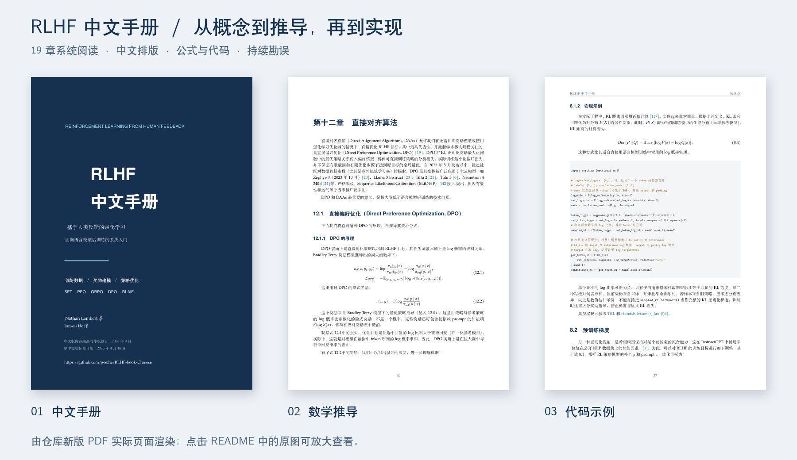
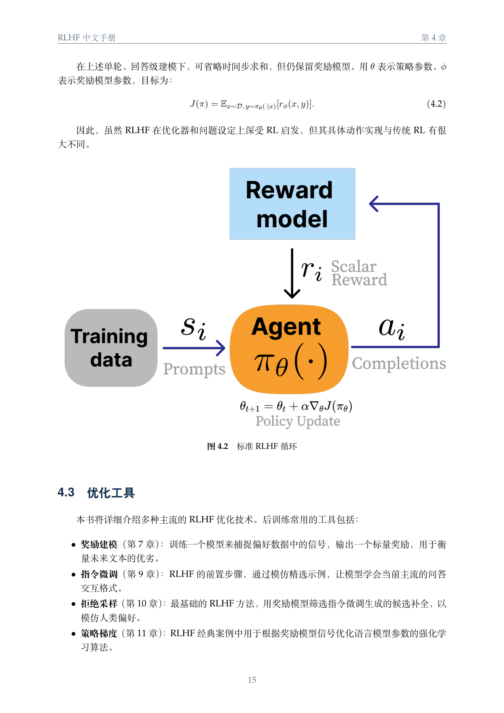
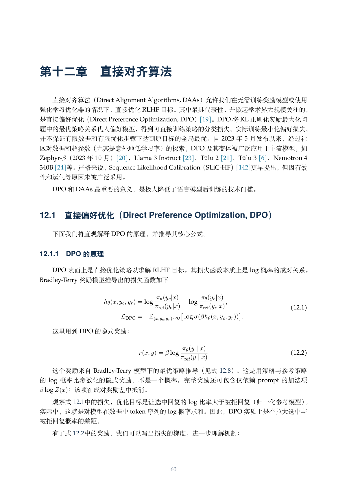
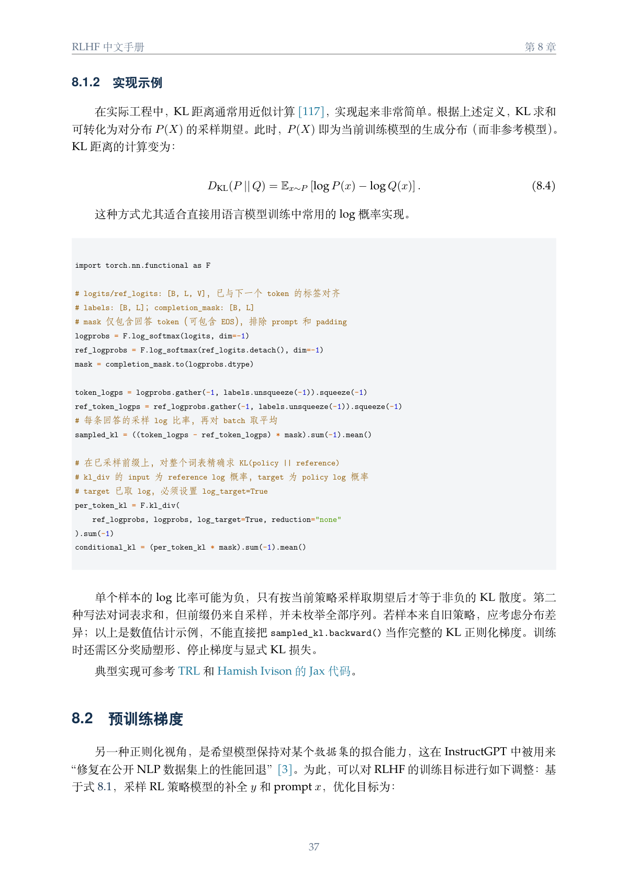

# RLHF 中文手册 · RLHF Book Chinese

[](https://github.com/jweihe/RLHF-book-Chinese/actions/workflows/static.yml)
[](LICENSE-Content.md)
[](LICENSE-Code.md)
[](CONTRIBUTING.md)

**从人类偏好到语言模型后训练：系统学习 SFT、奖励建模、PPO、DPO 与 AI 反馈。**

本项目是 Nathan Lambert 开源书籍 [Reinforcement Learning from Human Feedback](https://github.com/natolambert/rlhf-book) 的中文翻译，包含 **19 章**，覆盖基础概念、训练方法、评测与开放问题。适合具有机器学习基础、希望理解大语言模型后训练的学生、工程师和研究者。

**[在线阅读](https://jweihe.github.io/RLHF-book-Chinese/) · [下载 PDF](https://jweihe.github.io/RLHF-book-Chinese/book.pdf) · [按章阅读](#章节导航) · [提 Issue](https://github.com/jweihe/RLHF-book-Chinese/issues/new/choose) · [Fork 项目](https://github.com/jweihe/RLHF-book-Chinese/fork) · [参与贡献](CONTRIBUTING.md)**

> **2026-09 修订：** 更新中文 PDF 排版，修正奖励模型、KL、PPO/GRPO/GAE、DPO 等内容与代码问题。详见 [勘误与依据](docs/ERRATA.md)。原译稿标注日期为 2025-04-16，尚未完成与英文出版版的逐句核对；历史 Release `v1.0` 保留旧版。

## 先看看阅读效果

[](https://jweihe.github.io/RLHF-book-Chinese/)

**一本可以从头读，也可以按问题查的中文手册。** 19 章覆盖后训练流程；公式、图表和参考文献支持文内跳转；教学代码附数值验证，已确认的问题有公开勘误记录。

<details>
<summary>展开高清内页：训练流程、公式与代码（点击图片放大）</summary>

| 训练流程：把各环节串起来 | DPO：从目标到公式 |
| --- | --- |
| [](docs/assets/pdf-workflow.png) | [](docs/assets/pdf-formulas.png) |

[](docs/assets/pdf-code.png)

预览均从仓库 PDF 实际渲染，未改动页面内容。生成脚本与 PDF 校验值见 [预览脚本](scripts/make_pdf_previews.py) 和 [预览记录](docs/assets/previews.json)。

</details>

## 从哪里开始

- **快速建立全局认识：** 第 1 → 3 → 4 章，理解 RLHF 在后训练中的位置、符号和训练流程。
- **沿着训练流程学习：** 第 9 → 6 → 7 → 8 → 11 → 12 章，串起 SFT、偏好数据、奖励模型、正则化、PPO 与 DPO。
- **进一步阅读研究专题：** 第 13–17 章，了解 AI 反馈、推理、合成数据、评测与过度优化。

建议具备概率、梯度优化与 Transformer 基础；强化学习术语可从第 3 章查起。本仓库以教材内容和示例为主，不是可直接启动大规模训练的框架。

## 阅读方式

| 方式 | 入口与说明 |
| --- | --- |
| 在线阅读 | [中文阅读站](https://jweihe.github.io/RLHF-book-Chinese/)，含全书与 19 个独立章节页 |
| PDF | [在线 PDF / 下载](https://jweihe.github.io/RLHF-book-Chinese/book.pdf)，2026-09 勘误与排版修订，适合离线阅读 |
| Markdown 源码 | [chapters/](chapters/)，用于查看修订和提交纠错；下方目录直接打开在线章节 |
| Release | [发布记录](https://github.com/jweihe/RLHF-book-Chinese/releases)；`v1.0` 为历史 PDF，请优先阅读本次修订 |
| HTML / EPUB | 可在本地生成，见[构建指南](docs/BUILDING.md)；不将未发布的格式标成可下载版本 |

## 章节导航

以下链接均直接进入在线阅读站，公式、插图和引用已编译完成。

| 章 | 主题 | 阅读重点 |
| --- | --- | --- |
| 01 | [引言](https://jweihe.github.io/RLHF-book-Chinese/c/01-introduction.html) | RLHF 与后训练的全局图景 |
| 02 | [关键相关工作](https://jweihe.github.io/RLHF-book-Chinese/c/02-related-works.html) | 技术发展与代表性论文 |
| 03 | [定义与背景](https://jweihe.github.io/RLHF-book-Chinese/c/03-setup.html) | 语言建模、强化学习及 RLHF 术语 |
| 04 | [训练概览](https://jweihe.github.io/RLHF-book-Chinese/c/04-optimization.html) | 训练阶段与优化问题 |
| 05 | [偏好的本质](https://jweihe.github.io/RLHF-book-Chinese/c/05-preferences.html) | 偏好的理论基础与建模假设 |
| 06 | [偏好数据](https://jweihe.github.io/RLHF-book-Chinese/c/06-preference-data.html) | 数据来源、收集与质量 |
| 07 | [奖励建模](https://jweihe.github.io/RLHF-book-Chinese/c/07-reward-models.html) | 奖励模型的目标与训练 |
| 08 | [正则化](https://jweihe.github.io/RLHF-book-Chinese/c/08-regularization.html) | KL 约束及策略偏移 |
| 09 | [指令微调](https://jweihe.github.io/RLHF-book-Chinese/c/09-instruction-tuning.html) | IFT / SFT 与数据设计 |
| 10 | [拒绝采样](https://jweihe.github.io/RLHF-book-Chinese/c/10-rejection-sampling.html) | 生成、打分和筛选 |
| 11 | [策略梯度算法](https://jweihe.github.io/RLHF-book-Chinese/c/11-policy-gradients.html) | PPO、GRPO、RLOO 等方法 |
| 12 | [直接对齐算法](https://jweihe.github.io/RLHF-book-Chinese/c/12-direct-alignment.html) | DPO 等偏好优化方法 |
| 13 | [宪法 AI 与 AI 反馈](https://jweihe.github.io/RLHF-book-Chinese/c/13-cai.html) | Constitutional AI、RLAIF 与 LLM 裁判 |
| 14 | [推理训练与推理时扩展](https://jweihe.github.io/RLHF-book-Chinese/c/14-reasoning.html) | 推理能力与计算预算 |
| 15 | [合成数据与蒸馏](https://jweihe.github.io/RLHF-book-Chinese/c/15-synthetic.html) | 数据生成与知识迁移 |
| 16 | [评测](https://jweihe.github.io/RLHF-book-Chinese/c/16-evaluation.html) | 基准、比较与评测设计 |
| 17 | [过度优化](https://jweihe.github.io/RLHF-book-Chinese/c/17-over-optimization.html) | 奖励过优化与泛化问题 |
| 18 | [风格与信息](https://jweihe.github.io/RLHF-book-Chinese/c/18-style.html) | 回答风格与信息质量 |
| 19 | [产品、用户体验与模型个性](https://jweihe.github.io/RLHF-book-Chinese/c/19-character.html) | 后训练与实际用户体验 |

参考文献保存在 [`chapters/bib.bib`](chapters/bib.bib)。

## 本地构建

HTML / EPUB 需要 Python 3、Make、Pandoc 和版本兼容的 pandoc-crossref；PDF 还需要 XeLaTeX、LaTeX 宏包与中文字体。完整安装步骤、输出位置和常见错误见 [构建指南](docs/BUILDING.md)。

```bash
git clone https://github.com/jweihe/RLHF-book-Chinese.git
cd RLHF-book-Chinese
make html              # 首页、19 个章节页及资源
make epub              # EPUB，公式使用 MathML
make check             # 回归测试与 HTML 本地链接检查
```

`make pdf` 生成 PDF，`make docx` 生成 Word 文件，`make` 生成全部格式。所有产物位于 `build/`。

## 欢迎 Fork、Issue 和 PR

**不必一次贡献一整章。** 修正一个错字、说明一个公式中的疑问、补上一个失效链接，都能帮助后来的读者。

- **发现问题：** [提交 Issue](https://github.com/jweihe/RLHF-book-Chinese/issues/new/choose)，写清章节、原文位置、问题和建议；不确定怎么改也可以报告。
- **直接改进：** [Fork 仓库](https://github.com/jweihe/RLHF-book-Chinese/fork)，修改 Markdown 并提交 PR。流程与术语规范见 [贡献指南](CONTRIBUTING.md)。
- **帮助传播：** Star 收藏，将具体章节分享给学习小组、课程或同事，并保留原作者与中文仓库链接。

优先欢迎：翻译校对、术语一致性、公式与引用检查、构建与阅读体验修复，以及有来源的上游版本对照。新增解释请标明「译者注」，避免与原作者观点混淆。

## 维护方向

- [ ] 逐章记录对应的英文上游版本与差异。
- [x] 建立 [内容勘误与依据](docs/ERRATA.md)，为关键教学代码增加数值验证。
- [ ] 继续整理全书术语表与逐句对照。
- [ ] 校验多格式产物后发布带版本记录的阅读包。
- [x] 提供 [GitHub Pages 在线阅读入口](https://jweihe.github.io/RLHF-book-Chinese/)，并在主分支检查通过后自动部署。

这些是开放的贡献方向，不代表已经完成或承诺发布时间。欢迎先用 Issue 讨论范围。

## 引用与致谢

原著作者：[Nathan Lambert](https://github.com/natolambert)。中文翻译维护：[Junwei He](https://github.com/jweihe)。感谢 [所有贡献者](https://github.com/jweihe/RLHF-book-Chinese/graphs/contributors)，以及 [Pandoc](https://pandoc.org/) 和 [pandoc-book-template](https://github.com/wikiti/pandoc-book-template)。

引用具体理论或研究时，请引用原著及对应论文；引用本中文资源时，可使用：

```bibtex
@misc{rlhf_book_chinese,
  author = {Lambert, Nathan},
  title  = {RLHF 中文手册},
  year   = {2025},
  url    = {https://github.com/jweihe/RLHF-book-Chinese},
  note   = {中文翻译维护：Junwei He；请同时注明所使用的 commit 或发布版本}
}
```

内容与代码分别采用 [CC BY-NC-SA 4.0](LICENSE-Content.md) 与 [MIT](LICENSE-Code.md) 许可；原著、插图和引用材料保留原有署名及许可说明。
